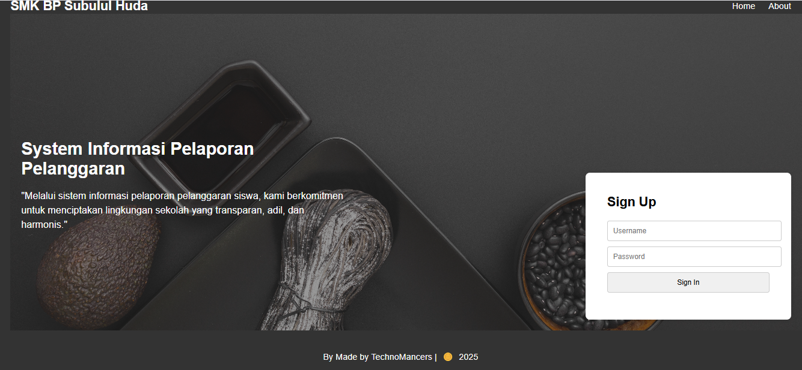
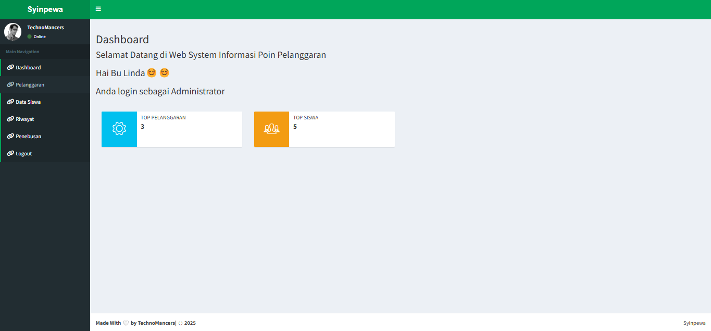
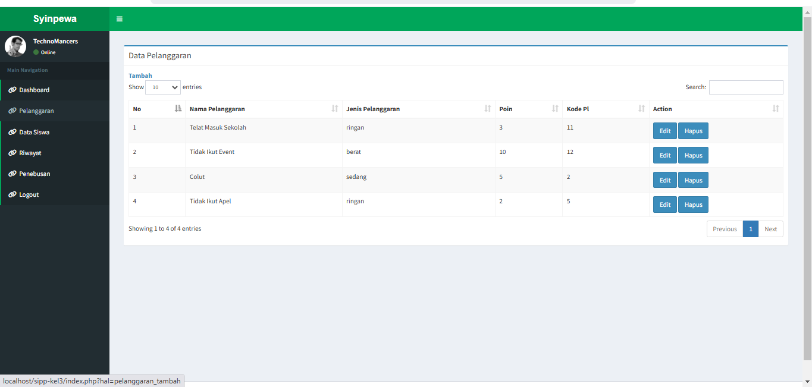
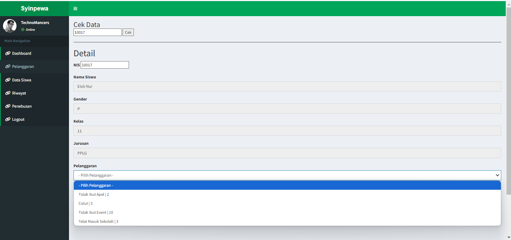

# panduan penggunaan

---

## login dan hak akses
1. untuk memulai aplikasi anda bisa membuka browser dan memasukan alamat berikut [`https://localhost/apg`](http://localhost/apg).
2. muncul tampilan halaman login.
     
3. Masukkan username `Admin` dan password `admin` untuk login sebagai administrator, lalu klik **login**  

---

## dashboard utama
 Dashboard adalah halaman utama setelah login. Di sini, Anda dapat melihat:
    
- **Jumlah Top Pelanggaran**
- **Jumlah Top Siswa**
- **Menu Navigasi di Samping Kiri** untuk mengakses berbagai fitur.

---
      
## data pelanggaran
1. Klik menu **Pelanggaran** di sisi kiri.
    
2. Tambahkan pelanggaran baru dengan mengisi data yang diperlukan.
    
3. Edit pelanggaran dengan memilih tombol **Edit**.
   
1. hapus pelanggaran dengan memilih tombol **Hapus**.

---

##  data Siswa
1. Klik menu **Data Siswa** di sisi kiri.
    
2. Lihat daftar siswa beserta informasi NIS, kelas, jurusan, dan poin pelanggaran.
3. Tambahkan siswa baru dengan mengisi data yang diperlukan.
    
4. Klik **Edit** untuk mengubah informasi siswa.
    
5. Klik **Hapus** untuk menghapus data siswa.

---

##  Riwayat
1. Klik menu **Riwayat** di sisi kiri.
2. Sistem akan menampilkan daftar riwayat pelanggaran yang telah terjadi.
    
3. Tambahkan siswa baru dengan mengisi data yang diperlukan.
    
4. Klik **Hapus** untuk menghapus data siswa.

---

## Penebusan
1. Klik menu **Penebusan** di sisi kiri.
2. Pilih siswa yang ingin menebus poin.
    
3. Tentukan jumlah poin yang akan ditebus lalu klik Tambah.
     
4. Masukan NISN Untuk Mengetahui Mana Yang Ditebus.
5. Konfirmasi dan simpan perubahan.
6. Klik **Hapus** untuk menghapus data Penebusan.

---

## 7. Logout dari Sistem
1. Klik menu **Logout** di sisi kiri.
2. Anda akan keluar dari sistem dan diarahkan ke halaman login kembali.

---

Panduan ini membantu administrator dalam mengelola sistem Syinpewa secara efektif. Jika ada kendala, hubungi tim teknis untuk bantuan lebih lanjut.