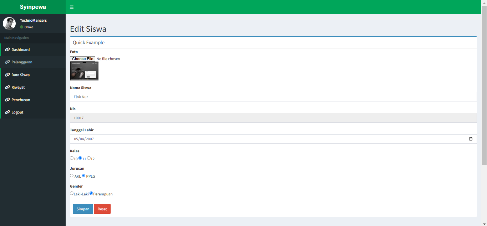

# panduan penggunaan

## login dan hak akses

1. untuk memulai aplikasi anda bisa membuka browser dan memasukan alamat berikut [`https://localhost/apg`](http://localhost/apg).
2. muncul tampilan halaman login.
     
3. Masukkan username `Admin` dan password `admin` untuk login sebagai administrator, lalu klik **login**  

 
## dashboard utama

 anda masuk ke halaman dashboard.

    
      Didalam Dashboard Terdapat Beberapa Tampilan Diantaranya :

      Pelanggaran, Data Siswa, Riwayat, Dan Penebusan 

## data pelanggaran

    

         Data Pelnggaran Berisi foto,Jenis Pelanggaran, poin, Dan kode Poin.
      selain itu pada menu ini terdapat Edit, Dan Hapus. yg Ketika di Klik Edit
      Maka Akan Muncul Halaman Seperti Dibawah Ini, Dan Ketika di Klik Hapus Maka
      Akan Langsung Menghapus

### menambah data Pelanggaran

    

### memperbaharui data Pelanggaran

    

### menghapus data Pelanggaran

      Data Pelanggaran Akan Langsung Terhapus

##  data Siswa

    

### menabah data Siswa

    

### memperbaharui data Siswa

    

### menghapus data Siswa

      Data Siswa Akan Langsung Terhapus

##  Riwayat

    

##  Cek Data Riwayat

    

### menghapus data Riwayat

      Data Riwatat Akan Langsung Terhapus

## Penebusan

    

### Cek data Penebusan

    

### menghapus data Penebusan

      Data Penebusan Akan Langsung Terhapus